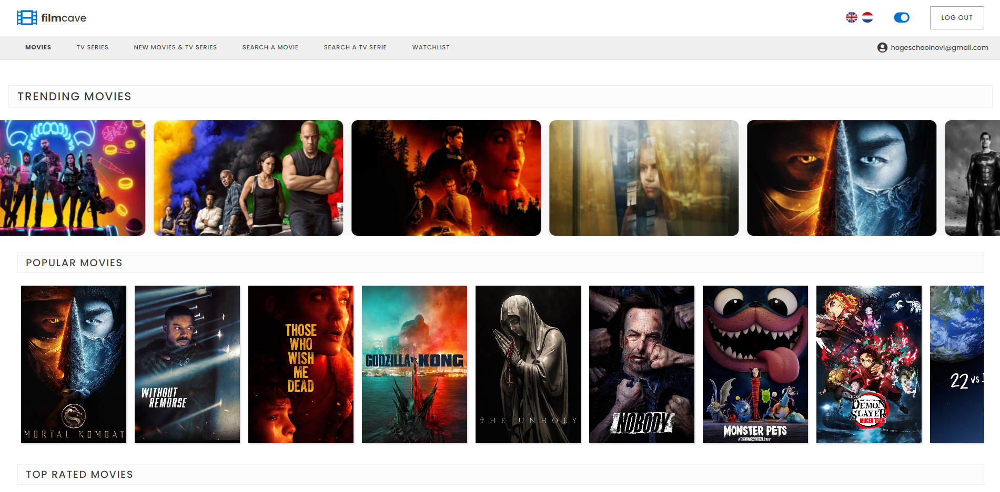
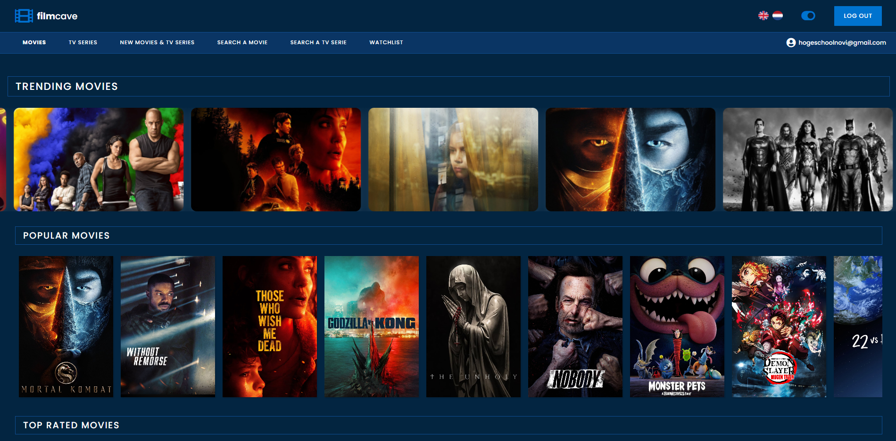

# **Project FilmCave**

FilmCave is een opkomende filmdatabank op het web. Het biedt een uitgebreide database aan met informatie over films, tv-series en casts. De site is echt een gigantisch depot van filminformatie, en het grootste deel ervan is volledig gratis en zeer toegankelijk. Als je ooit onderzoek gaat doen naar een film of acteur, ben je bij FilmCave aan het juiste adres.
  

## Het doel van FilmCave

FilmCave wordt de meest gezaghebbende bron van entertainmentinformatie, met functies die zijn ontworpen om fans te helpen de wereld van films en series te verkennen. FilmCave helpt de kijker om de beste film of serie te vinden en alles uit hun tijd te halen.
  

## Het eindresultaat

De applicatie is beschikbaar in zowel **light mode** als in **dark mode**.

### Light mode

### Dark mode

  

## Gebruikte framework

[React 17.0.2](https://reactjs.org/)
  

## Lokale server

Als je het project gecloned hebt naar jouw locale machine, installeer je eerst de node_modules door het volgende commando in de terminal te runnen:

`npm install`

Wanneer dit klaar is, kun je de applicatie starten met behulp van:

`npm start`

Open http://localhost:3000 om de pagina in de browser te bekijken.
  

## Inloggen

Om gebruik te kunnen maken van FilmCave moet je je eerst registreren. Daarna kun je inloggen en jouw gegevens inzien en beheren.  

## API

Link naar The Movie Database (TMDB) API:  
https://developers.themoviedb.org/3/getting-started/introduction
  

## Credits

Inspiratiebronnen:

- https://www.freecodecamp.org/news/react-movie-app-tutorial/
- https://medium.com/@levifuller/how-to-build-a-scalable-movie-browser-app-using-react-and-redux-in-visual-studio-code-dea8bfb3eabe
    

## Status

Er wordt momenteel _niet_ actief aan het project gewerkt.
  

## Author & support

[Jonas Tesfay](https://www.linkedin.com/in/jonas-tesfay-963557173/) 
Voor eventuele vragen kun je mij gerust een bericht sturen 😀 !
